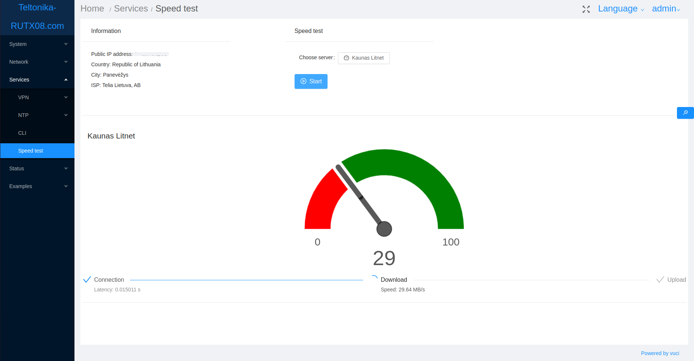

# vuci-speed-test
Vuci internet speed test using Lua and [Lua-cURL](https://github.com/Lua-cURL/Lua-cURLv3). 
#### Speed test process steps:
* System downloads speedtest server list.
* User selects best server or chooses server from downloaded list.
* Best server selected by filtering server list by user country and then doing latency tests. Server with lowest latency becomes best server. System uses ipwhois.app api to find user's location.
* User begins speed test by pressing Start button.
* Test begins with latency, then download and finish with upload tests.

#### Main page:

#### Server list window:

#### Main page with results:

